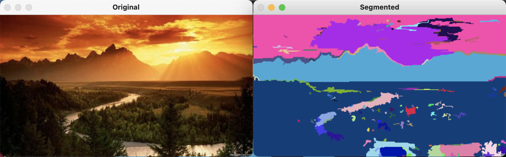

# image-segmentation
Python implementation of a Graph Based Image Segmentation Algorithm proposed by P. Felzenszwalb, D. Huttenlocher International Journal of Computer Vision, Vol. 59, No. 2, September 2004. 

## Table of Contents
* [General info](#general-info)
* [Technologies](#technologies)
* [Setup](#setup)
* [Author](#author)

## General Info
The motivation behind this project, and code explanation, can be found [here](http://vision.stanford.edu/teaching/cs231b_spring1415/papers/IJCV2004_FelzenszwalbHuttenlocher.pdf). Add images to the 'images' folder and update the file_name in the main method to see how the program segments the image into its components. The results will display, and be saved in the 'results' folder. You may also alter the segmentation variables within the main method to see how it affects the results.<br /><br />


## Technologies
Project is created with:
* Python version: 3.9.5
* cv2 (module) '$ pip3 install opencv-python'
* random (module)
* numpy (module) '$ pip3 install numpy'
* math (module)
* time (module)

## Setup
To run this project, make sure git is installed, move to your desired directory, and run the following commands.

```
$ git https://github.com/robertnetti/image-segmentation.git
$ cd image-segmentation
$ cd ImgSeg
$ python3 ImgSeg.py
```

## Author
* Robert Netti
* Linkedin: [https://www.linkedin.com/in/robert-netti/](https://www.linkedin.com/in/robert-netti/)
